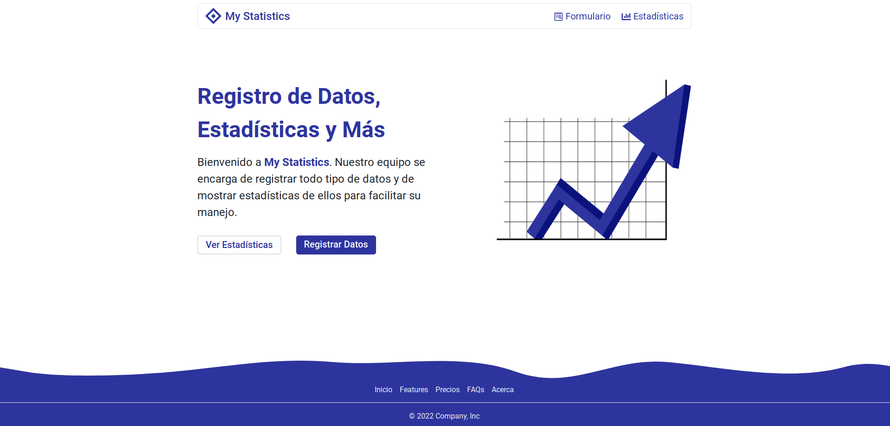
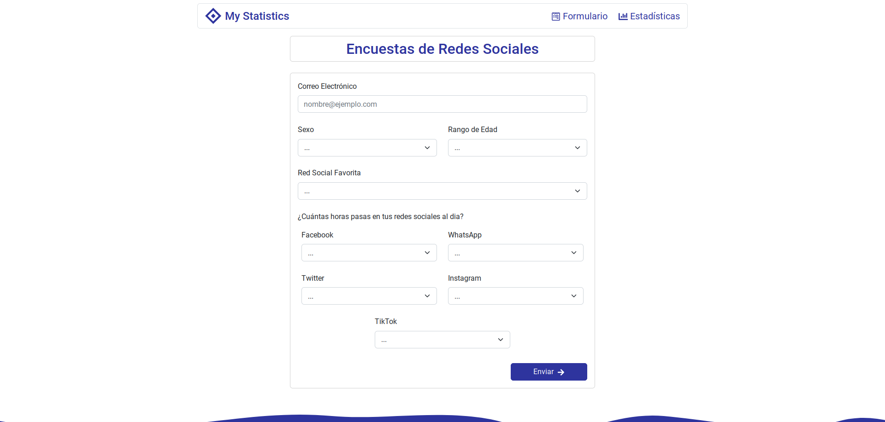
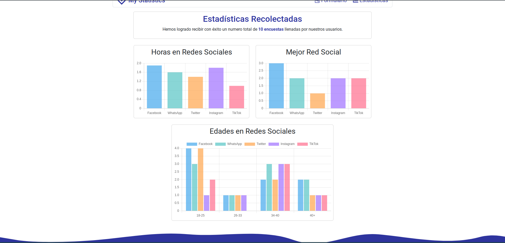
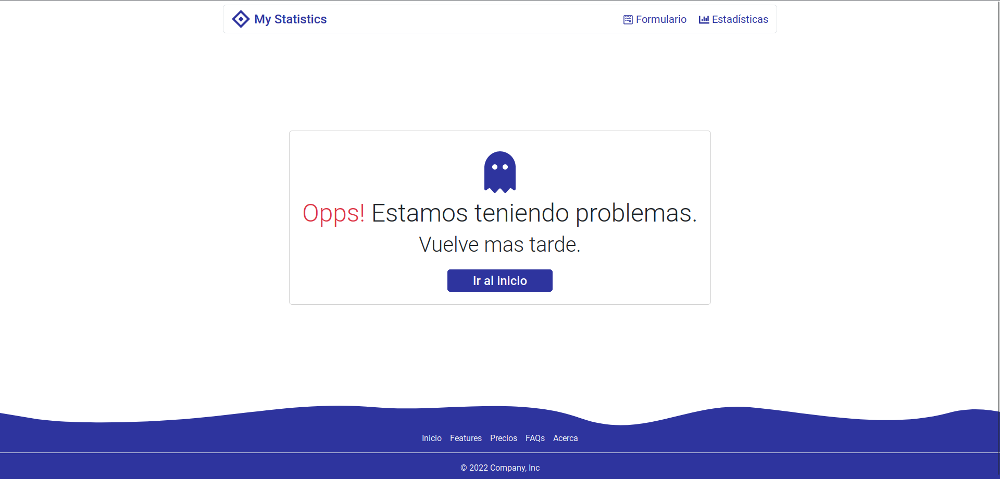
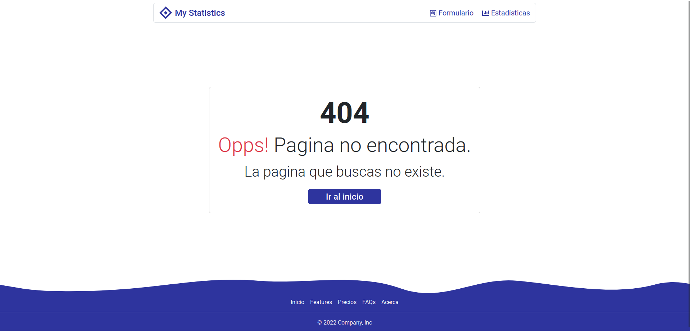

# My statistics

Este es un pequeño proyecto donde se puedes registrar datos y ver estadísticas de ellos usando **Json-server** como el backend.

## Como iniciar el proyecto en local:

- Crear un archivo **.env** copiando el contenido del **.env.example**

- Ve al directorio del proyecto y instala las dependencias con `npm install`

- Para correr el **frontend** deberás usar `npm run start`

- Para correr el **backend** deberás usar `npm run backend`

## Como hacer uso del proyecto:

Una vez iniciado el proyecto podrás ver:

&nbsp;

Para empezar a registrar datos puede hacer uso del botón de **Formulario** que esta en la navbar o en el botón azul que dice **Registrar Datos**. Ellos te llevaran a la siguiente pagina.

&nbsp;

Una vez registrado los datos puedes empezar a ver la estadísticas si usas el botón de **Estadísticas** que esta en la navbar o volviendo al inicio dándole click al botón **Ver Estadísticas**. Ellos te llevaran a ver los datos.

&nbsp;

## Algunas cosas a tomar en cuenta:

Si se te olvida iniciar el backend o tienes algún problema con el aparecerá el siguiente mensaje:

&nbsp;

Si te gustan ver errores **404 - Not Found** puedes jugar con la url y ver el error:

